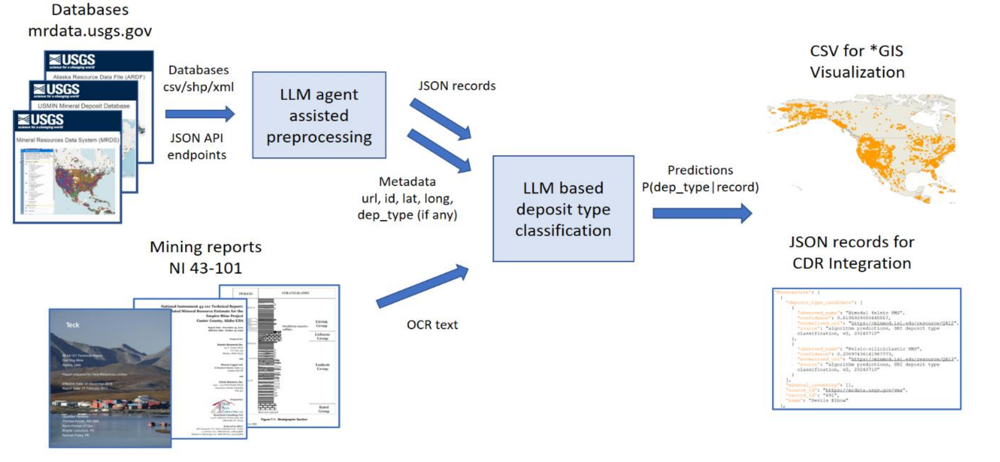

# SRI TA2 Deposit Type Classification v2.0.0



Older versions are available at https://github.com/DARPA-CRITICALMAAS/sri-ta2/classifier

## Installation

(Optional) It's recommended to use anaconda to make environment setup easier. Create a virtual environment in anaconda.
```
conda create --name cmaas-sri-ta2 python=3.9 -y
conda activate cmaas-sri-ta2

```

In a python>=3.6 environment, install the following packages
```
git clone https://github.com/DARPA-CRITICALMAAS/sri-ta2/
cd sri-ta2
pip install pandas
pip install openai backoff
conda install pytorch::pytorch torchvision torchaudio -c pytorch

```

PDF to text with OCR
```
pip install pdf2image pytesseract opencv-python
conda install tesseract poppler -y

```

Packages for running open source models
```
conda install pytorch torchvision torchaudio pytorch-cuda=11.8 -c pytorch -c nvidia -y
pip install transformers accelerate tokenizers sentencepiece openpyxl
pip install peft
conda install nvidia/label/cuda-11.8.0::cuda -y
pip install flash-attn

```

Note that GPUs with >=24GB of combined GPU RAM is required to run the open source pipeline.

## Download preprocessed data (optional)

Preprocessed mrdata databases available at https://www.dropbox.com/scl/fi/74hwx8vux058nyifriocz/dataset.tar.gz?rlkey=xan27f00he9wcozavc24wgerp&st=cut6tcwq&dl=1

Precomputed predictions on mrdata databases available at https://www.dropbox.com/scl/fi/nj0lulq6moaccpc6wlo2i/scores_agg_llama3-8b-ft.tar.gz?rlkey=2iy4adu23plce29crhusa19kz&st=cpxvwa42&dl=1

Model checkpoint for finetuned Meta-Llama-3-8B at https://www.dropbox.com/scl/fi/9svul8pzvp4wydk2brc5r/llama3-8b-ft_011_014.pt?rlkey=xpbfy9eje37v9lrn8hjptatdl&st=ldebdyyu&dl=1

## Classify new JSON records using the OpenAI pipeline

Follow these steps:

Add JSON records at `dataset/mrdata_json/{your database}​/{id}.json`.

Add an index dataframe for your JSON records at `index/sites/{your database}.csv`, one row per JSON record. The dataframe should have a column named `path` pointing to `mrdata_json/{your database}​/{id}.json`. Optionally include `id`, `name`, `latitude`, `longitude`, `deposit_type` and `url` columns that capture record id, site name, site location, deposit type information and link to record.

Launch predictions​. Run
```
python launch_gpt.py --openai_api_key {your_openai_api_key} --split index/sites/{your database}.csv --lm gpt-4o-mini
```
This will process sites in the index and output the deposit type distribution at `predictions/scores_qa_gpt-4o-mini/mrdata_json/{your database}​/{id}.gz` for each record. Each `{id}.gz` file is a compressed pytorch tensor (189-dim log probabilities), and can be loaded for inspection using `torch.load(gzip.open({fname},'rb'))`.

Create QGIS visualization. Run
```
python output_qgis_csv.py --split index/sites/{your database}.csv --scores predictions/scores_qa_gpt-4o-mini --out predictions/{your database}_gpt-4o-mini.csv
```
This will gather the scores based on the index and create a CSV file suitable for visualization in QGIS or other GIS software​.

Create JSON records for CDR integration. Run
```
python output_minmod_json.py --split index/sites/{your database}.csv --scores predictions/scores_qa_gpt-4o-mini --out minmod/sri/{your database}_gpt-4o-mini.json
```
This will gather the scores based in the index and create one or more JSON files for CDR integration​.

## Classify new reports using the OpenAI pipeline

Follow these steps:

(Optional) Organize PDF reports under a single folder, e.g. `dataset/{your folder}​/{id}.pdf`. Run OCR on folder of reports
```
python preprocess_ocr.py --pdf dataset/{your folder} --out dataset/{your database} --threads 8
```
This will run OCR on the reports, using 8 threads, and save the OCR results in json files under `dataset/{your database}/{id}.json`. The json files contain list of strings, one string for each text block in the PDF. The next step, deposit classification, will operate on the concatenated text.

Add OCR reports at `dataset/{your database}​/{id}.json`.

Add an index dataframe for your JSON records at `index/{your database}.csv`, one row per report. The dataframe should have a column named `path` pointing to `{your database}​/{id}.json`. Optionally include metadata including `id`, `name`, `latitude`, `longitude`, `deposit_type` and `url` columns that capture report id, site name, site location, deposit type information and link to report.

Launch predictions​. Run
```
python launch_reports_gpt.py --openai_api_key {your_openai_api_key} --split index/{your database}.csv --lm gpt-4o-mini
```
This will process reports in the index and output the deposit type distribution at `predictions/scores_qa_gpt-4o-mini/{your database}​/{id}.gz` for each report.

Create QGIS visualization. Run
```
python output_qgis_csv.py --split index/{your database}.csv --scores predictions/scores_qa_gpt-4o-mini --out predictions/{your database}_gpt-4o-mini_reports.csv
```
This will gather the scores based on the index and create a CSV file suitable for visualization in QGIS or other GIS software​.

Create JSON records for CDR integration. Run
```
python output_minmod_json.py --split index/{your database}.csv --scores predictions/scores_qa_gpt-4o-mini --out minmod/sri/{your database}_gpt-4o-mini_reports.json
```
This will gather the scores based in the index and create one or more JSON files for CDR integration​.

## Classify new JSON records using the open source pipeline

The steps are similar to the OpenAI pipeline, except the prediction step is done using the RAPMC algorithm with open source LLMs. For this example, we are running a finetuned Meta-Llama-3-8B model. Request access at https://huggingface.co/meta-llama/Meta-Llama-3-8B and obtain your huggingface token.

To launch predictions​. Run
```
python launch.py --hf_token {your_huggingface_token} --split index/sites/{your database}.csv
```
This will process sites in the index and output the deposit type distribution at `predictions/scores_llama3-8b-ft/mrdata_json/{your database}​/{id}.gz` for each record. Each `{id}.gz` file is a compressed 189-by-L pytorch tensor, where L is the number of tokens in the document.

For open source models, an additional postprocessing step is needed to calibrate and aggregate the scores across document length. Run
```
python postprocess_score.py --split index/sites/{your database}.csv
```
The final 189-type distribution will be stored at `predictions/scores_agg_llama3-8b-ft/mrdata_json/{your database}​/{id}.gz`. 

Proceed to create QGIS visualization with
```
python output_qgis_csv.py --split index/sites/{your database}.csv --scores predictions/scores_agg_llama3-8b-ft --out predictions/{your database}_llama3-8b-ft.csv
```
This will gather the scores based on the index and create a CSV file suitable for visualization in QGIS or other GIS software​.

Create JSON records for CDR integration. Run
```
python output_minmod_json.py --split index/sites/{your database}.csv --scores predictions/scores_agg_llama3-8b-ft --out minmod/sri/{your database}_llama3-8b-ft.json
```
This will gather the scores based in the index and create one or more JSON files for CDR integration​.


## LLM-agent assisted ingestion of database records

Our LLM agent is designed to generate and execute python code following natural language instructions, and will return a dataframe as the output. The agent can be invoked with
```python
import os
import pandas
import util.agent as agent
agent.set_openai_key({your_openai_api_key})
df_out=agent.run_df_agent("I have provided a database of mineral deposit resources under directory {folder}. The database consists of (folders of) json files, where each json file is a database record as a nested hybrid dictionary-list. Please help me index these records, returning a dataframe with 7 columns:\npath: ...")
df_out.to_csv('result.csv')
```

We have provided several example LLM agent scripts for automating ingestion of databases downloaded from https://mrdata.usgs.gov , into the JSON records and index files required for running the system. Our scripts essentially compose templated LLM agent instructions, iterating over multiple databases. Specifically

* Utilities for obtaining information from mineral databases​
** `preprocess_extract_url.py` contains LLM agent instructions for extracting the `ID` field from raw database files, and compose a link to download the json records from the mrdata website​
** `preprocess_crawl_json.py` is a downloader utility, that takes an `index/mrdata_links/{your database}.csv` file containing `{deposit_id, urls}` for each database, and download the data record using the url, and save the data records to `dataset/mrdata_json/{your database}/{deposit_id}.json​`
** `preprocess_index_sites.py` contains LLM agent instructions for extracting the `path`, `id`, `name`, `latitude`, `longitude`, `deposit_type` and `url` columns from a folder of JSON records.
* Utilities for mapping deposit type annotations to CMMI​
** `preprocess_crosswalk_annotation.py` contains examples for using LLM agents to map existing annotations to CMMI, which usually involves​: 1) extract USGS deposit numbers from annotations, and use a crosswalk table to map to CMMI​; 2) extract USGS deposit names from annotations, and use a crosswalk table to map to CMMI​; 3) extract string matching using a conversion table given by the user​.
* Utilities for generating train/eval data splits​
** `preprocess_generate_splits.py` divides annotated sites by latitude, in 2.5 degree bands, into training and testing​. And then create harder "redacted" records that do not have expert deposit type annotations​ for training high performance models.

## Training

This section is for advanced users who wish to improve the performance of the open source RAPMC pipeline.

* Finetuning the LLM
​** Run `train_finetune.py` to finetune a pretrained LLM using DPO-LoRA​. Checkpoints will be saved to `sessions/xxxxxxx/{iter}.pt`​ The checkpoints can then be used for `launch.py`.​

* Training a score refinement module​
** Run `launch.py` to run LLM to compute scores on train/eval data ​
** Run `train_score.py` to train a neural network for refining predicted scores​. This learns an invariant neural network that's invariant to both word and deposit type permutations.​ Checkpoints will be saved to `sessions/xxxxxxx/{iter}.pt`​ The checkpoints can then be used for `postprocess_score.py`.​


## Docker (work in progress)
Dockers for this repo will be provided at [https://hub.docker.com/r/grrrgrrr/sri-ta2/tags]. Nvidia GPU-enabled docker is required to run the dockers. 

## Version history
* 2023-Nov-04 Add initial open source pipeline 
* 2023-Nov-04 =>v1.1 Using LLM for retrieval instead of embeddings
* 2024-Feb-22 =>v0b Match algorithm version with hackathon deposit type prediction dataset version. Add MRDS JSON processing capability.
* 2024-Apr-26 =>v1.0.0 Improve reasoning context for MRDS JSON. Improve speed. Provide dockerized containers.
* 2024-Aug-11 =>v2.0.0 Pipeline redesign to enable batch processing. Add OpenAI pipelines. Add LLM agents for preprocessing. Initial documentation.