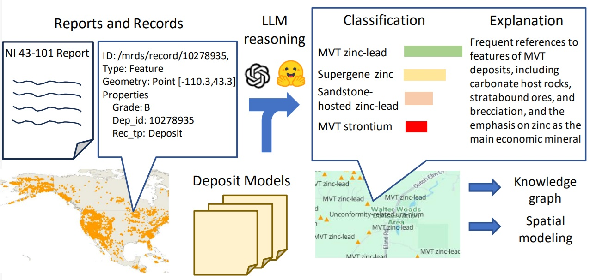

# SRI TA2 Deposit Type Classification v0b



## Installation

(Optional) It's recommended to use anaconda to make environment setup easier. Create a virtual environment in anaconda.
```
conda create --name cmaas-sri-ta2 python=3.9 -y
conda activate cmaas-sri-ta2
```

In a python>=3.6 environment, install the following packages

```
conda install pytorch torchvision torchaudio pytorch-cuda=11.8 -c pytorch -c nvidia -y
pip install transformers accelerate tokenizers sentencepiece openpyxl pandas
```

PDF to text with OCR
```
pip install pdf2image pytesseract opencv-python
conda install tesseract poppler -y
```

OpenAI GPT-4 explanations
```
pip install openai backoff
```

Note that GPUs with >=24GB of combined GPU RAM is required to run the system.

## Usage (NI 43-101 reports)
(Optional) Choose one (or a subset) of GPUs with >=24GB of combined GPU RAM. The implementation is single threaded so using fewer GPUs is faster. 
```
export CUDA_VISIBLE_DEVICES=0
```

(Optional) Download an example PDF report. For example, the empire state mine NI 43-101 report.
```
wget https://titanminingcorp.com/site/assets/files/5210/ti-empire_state_mines_2021_ni_43-101_technical_report.pdf
```

Deposit type classification on a given PDF document
```
python run.py --pdf <path/to/pdf.pdf> --options labels_type.csv
```
This will run the deposit type classification pipeline on the given PDF document. An example deposit classification output for the empire state mine NI 43-101 report is:
```
Rank 1  0.1234  Siliciclastic- carbonate zinc-lead
Rank 2  0.0996  MVT zinc-lead
Rank 3  0.0857  Irish-type sediment- hosted zinc- lead
Rank 4  0.0768  Siliciclastic-mafic zinc-lead
Rank 5  0.0666  Sandstone-hosted zinc-lead
Rank 6  0.0315  Supergene zinc
Rank 7  0.0282  Orogenic silver-lead- zinc-copper- antimony
Rank 8  0.0261  Felsic-siliciclastic VMS
Rank 9  0.0241  MVT strontium
Rank 10 0.0228  Bimodal felsic VMS
```

By default, this process will first run OCR on the document to extract text, then determine deposit type by making calls to [NousResearch/Llama-2-7b-hf](https://huggingface.co/NousResearch/Llama-2-7b-hf) for multiple choice QA. Each run typically takes 5 min on a threadripper TR 1950x for OCR and a single RTX A5000 for LLM inference. OpenAI GPT-4 justifications of the answer will be provided if you enter your openai api key as follows
```
python run.py --pdf <path/to/pdf> --options labels_type.csv --openai_key <your_openai_api_key>
```
Model for multiple choice QA can be configured with `--lm NousResearch/Llama-2-7b-hf`. 

Results for each run will be stored in `./sessions/vvvvvvv/`. `predictions.csv` stores the top-10 predicted deposit types and their predicted probability. `relevant_paragraphs.csv` stores the top 20 relevant paragraphs retrieved sorted by their relevance score. `explanation.json` stores the GPT justification. For debugging purposes, there are also `params.json` storing the command line parameters and `ocr.json` storing the text extracted from the document.

## Usage (MRDS JSON records)
```
python run_json.py --json <path/to/json.json> --options labels_type.csv --openai_key <your_openai_api_key>
```
Similar to processing PDFs, this will run the deposit type classification pipeline on the given JSON record. [NousResearch/Llama-2-7b-hf](https://huggingface.co/NousResearch/Llama-2-7b-hf) will be used by default. The LLM weights will be downloaded during the first run. Each subsequent run typically takes ~5 min on a single RTX A5000. OpenAI GPT-4 justifications of the answer will be provided if you enter your openai api key.

Results for each run will be stored in the `./sessions/vvvvvvv/` folders. An example classification for the included `test.json` is

```
Rank 1  0.0158  Mafic-ultramafic VMS
Rank 2  0.0141  Skarn copper
Rank 3  0.0140  U-M layered intrusion PGE
Rank 4  0.0133  Mafic-siliciclastic VMS
Rank 5  0.0131  LCT pegmatite
Rank 6  0.0125  Vein tungsten
Rank 7  0.0123  NYF pegmatite
Rank 8  0.0123  U-M intrusion nickel-copper- PGE
Rank 9  0.0122  Exotic copper
Rank 10 0.0121  Greisen tungsten- molybdenum ±Bi
```


## Version history
* 2023-Nov-04 Add initial open source pipeline 
* 2023-Nov-04 =>v1.1 Using LLM for retrieval instead of embeddings
* 2024-Feb-22 =>v0b Match algorithm version with hackathon deposit type prediction dataset version. Add MRDS JSON processing capability.
