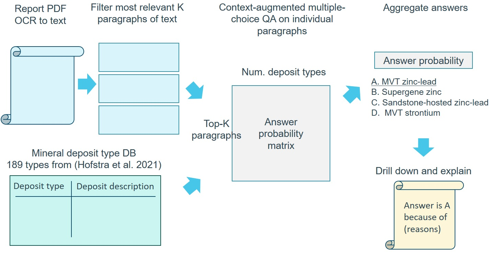

# SRI TA2 Deposit Type Classification v1.1 



## Installation

In a python>=3.6 environment, install the following packages

```
conda install pytorch torchvision torchaudio pytorch-cuda=11.8 -c pytorch -c nvidia
pip install transformers==4.31
pip install accelerate
pip install tokenizers
pip install sentencepiece
pip install protobuf==3.19
pip install openpyxl
```

PDF to text with OCR
```
pip install pdf2image
pip install pytesseract
pip install opencv-python
conda install tesseract
conda install poppler
```

OpenAI GPT-4 explanations
```
pip install openai
pip install accelerate
pip install backoff
```

Note that GPUs with >=24GB of combined GPU RAM is required to run the system.

## Usage
Deposit type classification on a given PDF document
```
python run.py --pdf <path/to/pdf.pdf> --options labels_type.csv
```
This will run the deposit type classification pipeline on the given PDF document. By default, this process will first run OCR on the document to extract text, then determine deposit type by making calls to [NousResearch/Llama-2-7b-hf](https://huggingface.co/NousResearch/Llama-2-7b-hf) for multiple choice QA. Each run typically takes 3~4 min on a single RTX A5000. OpenAI GPT-4 justifications of the answer will be provided if you enter your openai api key as follows
```
python run.py --pdf <path/to/pdf> --options labels_type.csv --openai_key <your_openai_api_key>
```
Model for multiple choice QA can be configured with `--lm NousResearch/Llama-2-7b-hf`. 

Results for each run will be stored in `./sessions/vvvvvvv/`. `predictions.csv` stores the top-10 predicted deposit types and their predicted probability. `relevant_paragraphs.csv` stores the top 20 relevant paragraphs retrieved sorted by their relevance score. `explanation.json` stores the GPT justification. For debugging purposes, there are also `params.json` storing the command line parameters and `ocr.json` storing the text extracted from the document.


